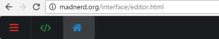
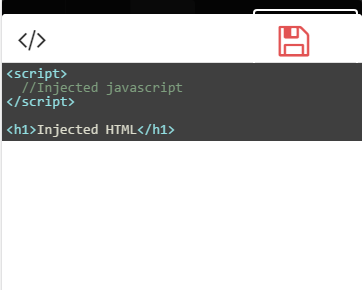
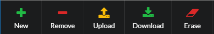

[Français](https://madnerdorg/libreinterface/readme_fr)

   
[Arduino Applications](http://madnerd.org/interface) / [Code Editor](http://madnerd.org/interface/editor) / [Download](https://github.com/madnerdorg/libreinterface/archive/master.zip)  

- [What is LibreInterface ?](#what-is-libreinterface-)
- [Applications](#applications)
    - [Example applications for libreConnect](#example-applications-for-libreconnect)
    - [Code your webpage in a text editor](#code-your-webpage-in-a-text-editor)
    - [Code your webpage inside your web browser.](#code-your-webpage-inside-your-web-browser)

# What is LibreInterface ?
LibreInterface is a web application to build static webpage.    
You can use it to create local web page or remotes/dashboards for arduino (using the examples provided) and share it as a json file.

LibreInterface is bundle with a lot of useful libraries, so it can works even without an internet connection
* Semantic UI / Jquery (for the design)
* WebMidi (control midi using a webpage)
* Highlight/Code Mirror (display code)
* Markdown-browser (Display markdown as a webpage)
* Highcharts (Create charts)
* Reconnecting Websocket (auto reconnect websocket)

# Applications
## Example applications for libreConnect
There are examples for my [arduino devices](http://madnerdorg.github.io/libreconnect)     


## Code your webpage in a text editor
* Copy **blank.html** into a new file
```
blank.html --> homepage.html
```
* Add your code inside body

You can learn how to create elements at [semantic-ui.com](https://semantic-ui.com/)

## Code your webpage inside your web browser.
You can also use the online editor      
All changes are saved **inside your browser** using localStorage and can be export as a json file.

* Go to madnerd.org/interface/editor.html 
* Click on the green icon to edit the code of the page using codemirror:    

* The code will be injected inside this div, when you saved it.     
```
<div id="application" class="custom-code"></div>
```


Code is saved inside localStorage in your browser, you can create as much pages as you like.   

You can also share your code using upload/download, this will download/upload your localStorage (for the current domain) as a json file.    


The editor works on smartphone/tablet using firefox/chrome, I recommended using a bluetooth keyboard or a least this key layout [Hacker's keyboard](https://play.google.com/store/apps/details?id=org.pocketworkstation.pckeyboard)  

> You can use the variable isComputer to change how the application behave on a phone or a computer.      

# Licences
* Markdown-js : MIT (https://github.com/evilstreak/markdown-js)
* Code Mirror: MIT (https://codemirror.net/)    
* Semantic UI: MIT (https://semantic-ui.com/)   
* Highlight-JS: BSD 3 (https://highlightjs.org/)    
* Semantic-UI-Range: MIT (https://github.com/tyleryasaka/semantic-ui-range)
* Jquery: Apache v2 (http://jquery.com/)       


